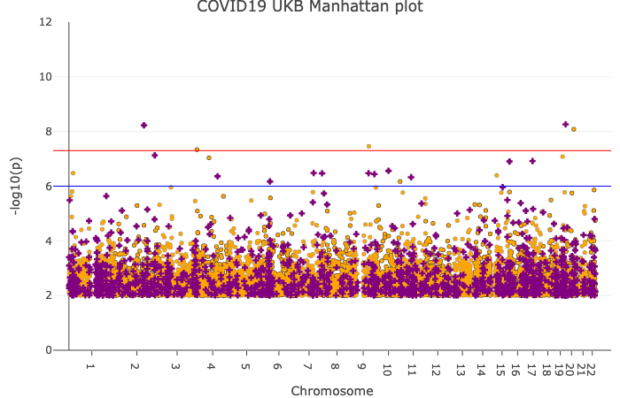

# The COVID-19 dataset in UK Biobank

We performed a series of analysis using [the COVID-19 dataset from UK Biobank](http://biobank.ndph.ox.ac.uk/ukb/exinfo.cgi?src=COVID19).

- [Armstrong, J. et al. Dynamic linkage of Public Health England’s Second Generation Surveillance System to UK Biobank provides real-time outcomes for infection research. (2020)](https://doi.org/10.6084/m9.figshare.12091455.v1).



**Fig.** Manhattan plot from our meta-analyzed Genome-wide association analysis (GWAS) within UK Biobank.

## COVID-19 case definition

We primarily considered the COVID-19 test results (`result`) column in [the data release from UK Biobank](http://biobank.ndph.ox.ac.uk/ukb/exinfo.cgi?src=COVID19) for our case definition. For our controls, we used the rest of the entire UK Biobank samples with genotype data.

As a comparison, we used a narrower definition of cases -- tested positive **and** hospitalized -- as [suggested by Dr. Danny Wilson](https://news.bugbank.uk/2020/04/interpreting-uk-biobank-covid-19-test.html). We compared the GWAS summary statistics generated for those two case assertation and confirmed that their genetic correlation is `rg=1` (see below).

## Demographic distribution of COVID-19 cases in UK Biobank

We first examined the first two components of genotype PCs for individuals in case (in red) and control (in gray) sets.

To see if we can see a difference in the demographic distributions beteen cases and controls, we first tabulated the number of cases and contorls in different sub-populations in UK Biobank. In our previous work, we previously used those genotye PCs to define "populations" consists of unrelated individuals within UK Biobank.

| population        | case | control | n      | case_frequency |
|-------------------|------|---------|--------|----------------|
| White British     | 388  | 336750  | 337138 | 0.12%          |
| Non-British white | 41   | 24864   | 24905  | 0.16%          |
| South Asian       | 24   | 7861    | 7885   | 0.30%          |
| African           | 40   | 6457    | 6497   | 0.62%          |
| East Asian        | 3    | 1151    | 1154   | 0.26%          |
| all               | 636  | 487741  | 488377 | 0.13%          |

## Clinical risk factor association

We assessed the clinical risk factors for COVID-19. Specifically, we applied the following logistc regression model:

```{R}
logit(COVID-19) ~ 1 + age + sex + scale(BMI) + scale(Townsend) + Creatinine + Cystatin_C + LDL + as.factor(population)
```

- BMI and Townsend deprivation index are from UK Biobank fields 21001 and 189, respectively.
- LDL is adjusted for statin use.
- We used individuals not in our "population" definition as the reference class in `as.factor(population)`.

## Genome-wide association analysis (GWAS)

We performed the GWAS analysis for the following set of unrelated individuals.

- Europeans: This is an union of White British and Non-British White described above. We label this as `WB_NBW` in the results file.
- African population within UK Biobank
- South Asian population within UK Biobank
- White British unrelated individuals
- Everybody: we label this as `all` in the results file.

### GWAS scan with plink

Using `plink2`, We applied the Genome-wide association analysis (GWAS) for the following set of variant sets.

- Genotyped variants directly genotyped on array
- HLA alleotypes (2 digit resolution)
- Copy number variations (CNVs)
- Exome dataset (GRCh38)

Our regression model in the analysis was as follows:

```{R}
logit(COVID-19) ~ age + sex + Array + PC1 + ... + PC10 + N_CNV + LEN_CNV
```

- `PC1 + ... + PC10` is the first 10 components of genotype PCs. Specifically, we used either the global genotype PCs (for `all` and `WB_NBW`) or population-specific local PCs (for White British, African, and South Asian).
- `N_CNV` and `LEN_CNV` are the number and length of copy number variations.

Additionally, we applied GWAS with the following models:

1. Recessive model
    - We used `--glm recessive` option in plink2 to perform GWAS scan with the recessive model.
2. GWAS with more covariates
    - We used `BMI` and `Townsend` deprivation index as additional covariates.

In [our previous pre-print](https://doi.org/10.20944/preprints202003.0356.v1), we focused on disease assertation and mortality information for infectious diseases, and acute respiratory infections. To evaluate the genetic correlation with those phenotypes, we also applied the GWAS scan for those two phenotypes, which we denote as `Tanigawa et al, disease` and `Tanigawa et al, death`, respectively.

### Analysis on X chromosome

We performed the association analysis for genetic variants on X chromosome using the same procedure. We compared the results with meta-analyzed results derived from male- and female- specific association analysis.

### Meta-analysis with metal

Using the GWAS summary statistics for White British, African, and South Asian, we performed meta-analysis within UK Biobank with [Metal](http://csg.sph.umich.edu/abecasis/metal/).

## Genetic correlation analysis

We applied [LD score regression](https://github.com/bulik/ldsc) to estimate the genetic correlations among traits.

### Case definition comparison

In the "COVID-19 case definition" section above, we explained our COVID-19 case definition, which is simply looking at the COVID-19 test results column. An alternative approach is to focus on hospitalized COVID-19 patients. We evaluated the genetic correlation between summary statistics generated from those two and confirmed that `rg=1`.

### disease assertation and mortality information for infectious diseases, and acute respiratory infections

We also evaluated the genetic correlation between COVID-19 and [`Tanigawa et al, disease` and `Tanigawa et al, death`](https://doi.org/10.20944/preprints202003.0356.v1).

### blood measurements and biomarkers

We provided PRS for blood measurements and biomarkers in this repository. In [the same pre-print](https://doi.org/10.20944/preprints202003.0356.v1), we showed correlation between PRSs for blood measurements and disease assertation and mortality information for infectious diseases, and acute respiratory infections.

We evaluated the genetic corelations of those blood measurements.

### Other phenotypes in Global Biobank Engine

In Global Biobank Engine, we host summary statistcs for > 2000 phenotypes. We performed the phenome-wide genetic correlation scan.

## PRS PheWAS analysis

We [previously provided PRSs for blood measurements and biomarkers](https://doi.org/10.20944/preprints202003.0356.v1). We asked whether those PRSs are correlated with COVID-19.

## ABO forest plot

In [the same pre-print](https://doi.org/10.20944/preprints202003.0356.v1), we highlighted the importance of further data sharing of the ABO frequency data. With the COVID-19 datasets from UK Biobank, we evaluated the associations between the ABO blood type and COVID-19.

## Web application

We complied our results into a web application. Currently, we display the following results:

- Manhattan plot: GWAS analysis
- PRS PheWAS
- Principal components: Genotype PCs of case and control individuals
- Biomarkers and towsend association
- Genetic correlation
- Clinical risk factor association: the results from logistic regression on clinically relevant risk factors
- ABO forest plot

The web application will be continuously updated as new analysis and projects come online.

## Analysis scripts

We are cleaning up the analysis scripts for public release.

## Acknowledgement

We thank Kilian Cavalotti and [Stanford Research Computing Center](https://srcc.stanford.edu/) for [providing prioritized queue for COVID-19 research](http://news.sherlock.stanford.edu/posts/sherlock-joins-the-fight-against-covid-19).

## Reference

- [UK Biobank: COVID-19 data](http://biobank.ndph.ox.ac.uk/ukb/exinfo.cgi?src=COVID19)
- [Y. Tanigawa, M. Rivas, Initial Review and Analysis of COVID-19 Host Genetics and Associated Phenotypes (2020)](https://doi.org/10.20944/preprints202003.0356.v1).
- [UK Biobank : Category 100081. Blood count - Blood assays - Assay results - Biological samples](http://biobank.ctsu.ox.ac.uk/crystal/label.cgi?id=100081).
- [Sinnott-Armstrong, N. et al. Genetics of 38 blood and urine biomarkers in the UK Biobank. bioRxiv 660506 (2019)](https://doi.org/10.1101/660506).
- [Willer, C. J., Li, Y. & Abecasis, G. R. METAL: fast and efficient meta-analysis of genomewide association scans. Bioinformatics 26, 2190–2191 (2010)](https://doi.org/10.1093/bioinformatics/btq340).
- [Bulik-Sullivan, B. K. et al. LD Score regression distinguishes confounding from polygenicity in genome-wide association studies. Nature Genetics 47, 291–295 (2015)](https://doi.org/10.1038/ng.3211).
- [Bulik-Sullivan, B. et al. An atlas of genetic correlations across human diseases and traits. Nature Genetics 47, 1236–1241 (2015)](https://doi.org/10.1038/ng.3406).
- [Aguirre, M., Rivas, M. A. & Priest, J. Phenome-wide Burden of Copy-Number Variation in the UK Biobank. The American Journal of Human Genetics 105, 373–383 (2019)](https://doi.org/10.1016/j.ajhg.2019.07.001).
- [Sherlock joins the fight against COVID-19. Stanford Research Computing Center](http://news.sherlock.stanford.edu/posts/sherlock-joins-the-fight-against-covid-19).
